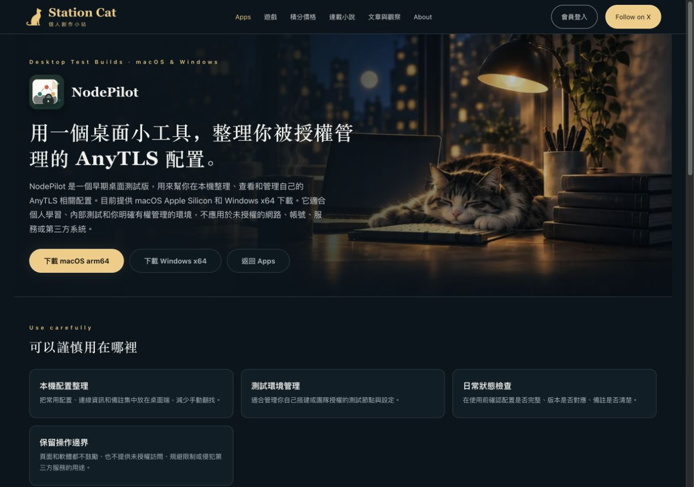
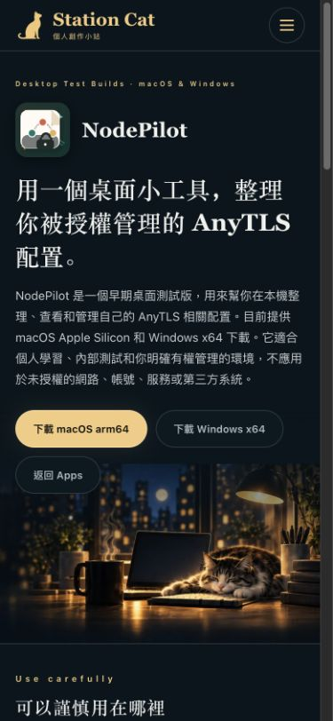
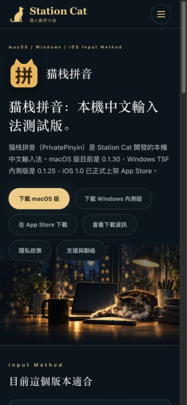

# App 产品页深夜风格

六个产品介绍页（SnapCopy、花有数 / MindBudget、NodePilot、NovelForge AI、猫栈拼音、SimpleCut Pro）统一使用深蓝底、暖金操作按钮、猫咪书桌背景和响应式内容卡片。沿用仓库现有插画，不增加图片或字体依赖。

## 变更边界

基于 main 532a410 整理。保留主线的 SEO 标题、四语规范路径、产品版本、下载地址、反馈表单数据钩子及提交逻辑；音乐导航继续使用主线 musicEntryEnabled 门控。新主题由产品介绍页显式启用，下载、支持与法律页面沿用原主题。

本 PR 不包含独立的 NodePilot 0.2.27 发布、Worker 映射或 NovelForge 法律条款修改；这些改动仍保留在原本地工作区。

## 验证

- `npm test` 完整通过。
- `ALLOW_EMPTY_SERIAL_CONTENT=1 npm run build` 通过（新工作区不携带未跟踪的小说正文，使用仓库 CI 相同的空内容选项）。构建后的站点基础与关闭音乐入口检查通过。
- `node scripts/test-product-night.mjs`：24 个四语产品页的菜单语言与页脚路径、20 个配套页面主题检查通过，已加入 CI。
- `PUBLIC_MUSIC_ENTRY_ENABLED=true` 的构建与产品检查通过；英文 1024px 使用折叠菜单，1280px 导航无横向溢出。
- 产品目录、NovelForge 发布、PrivatePinyin 发布、反馈表单专项检查通过。
- 本地浏览器复核六个繁中页面在 390px 下无横向溢出、无已加载失败的图片；验证 SimpleCut 手机菜单切换至英文产品页，再进入 `/en/privacy/`。
- 此前 UI 复查覆盖 320 / 390 / 768 / 1280px，包括按钮对比度、截图比例、表单焦点与输入字号。主线整合后的代表截图见下方。

这是本地浏览器验证，未进行实体 iPhone 验收、真实反馈提交或安装包下载。本 PR 尚未部署。

## 主线整合后截图

