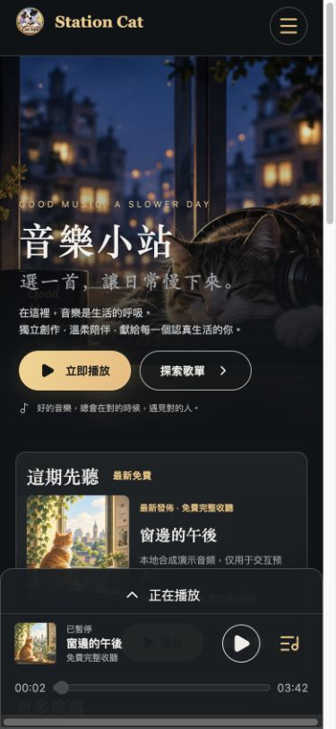

# 音乐首页与既有 UI 改动审查

音乐首页按照已确认的参考图调整为夜景、深色背景与暖金色按钮：主视觉、主推歌曲、更多推荐、专辑、筛选列表和底部播放器采用统一布局。主题只作用于音乐页面。

以下截图使用本地演示曲库；正式页面继续读取真实歌曲、封面、权限和数量。桌面截图为页面上部，手机截图为首屏。

## 一并提交的改动

- 音乐入口及主页推荐展示、后台导航尺寸、可调整上传配额、精简专辑资料和操作说明。
- 独立专辑封面、批次上传恢复、发布时加入成功曲目并发布成员歌曲、可设置结束时间的限时免费。
- 单曲按钮调整、全屏播放器直接显示歌词及时间轴高亮、减少无须操作的本机恢复提示。
- 专辑海报、横版分享卡、二维码、图片保存与系统分享、复制链接和 X 入口；朋友圈通过保存海报后手动发布。
- 分享图片生成优化、独立限流及重试冷却、介绍文字换行符导致缺字方框的修复。

## 审查与验证

配套服务端代码和音乐数据库迁移 0009–0011 包含在此次差异中，不能只取 UI 文件。迁移用途分别是独立专辑封面、限时免费和分享图片独立限流；本次提交不执行部署或数据库迁移。

120 项播放器、曲库、面板、歌词、分享和限流相关测试通过；Astro 构建与构建后检查通过。浏览器检查涵盖 1122、820、390 像素宽度、播放/暂停、歌曲详情、筛选、专辑分享图生成、全屏歌词和单一音频实例，未发现横向溢出。

手机布局使用浏览器响应式模式检查，未在实体 iPhone 或微信中复测，也未发布任何社交内容。
