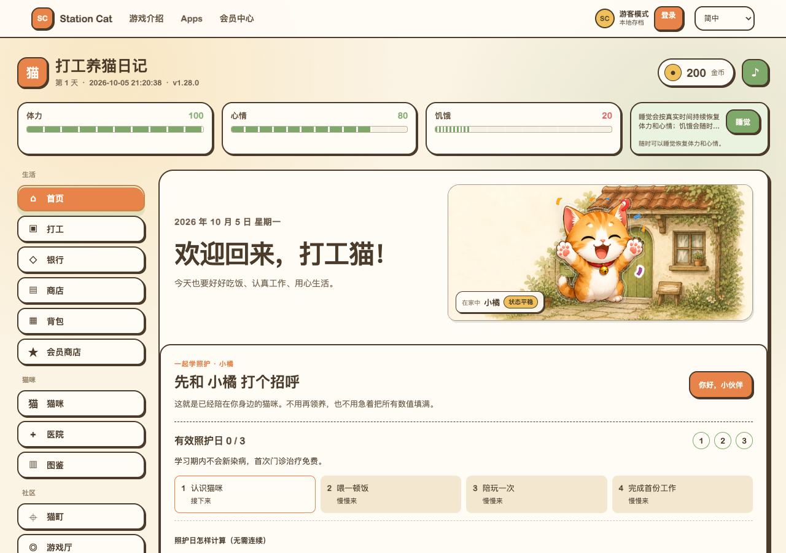
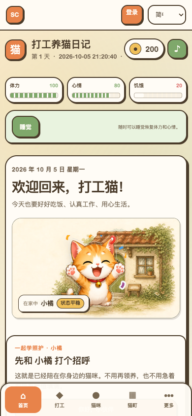

# T03 权益、存档与素材核对

核对日期：2026-10-05。目标仓库为 `xdgf558/caption-ai-landing-site`；本次从 T02 提交 `877a331214ca3747a50f15bb9ee3b17348dac536` 核对，应用代码仍与 `6cbb19725cd12ae718ea395711f920adef346824` 一致。下列源码链接固定到该应用提交，避免后续实现改变本次结论。

已有账号、会员、支付、历史权益、网页收藏、原生资料库和游戏存档各有实现，本期复用各自的权限来源。隔离测试确认了关键行为，同时发现新版“继续游戏”不能直接复用当前 `loadOrCreateGame()`：损坏 JSON 会被识别为空，随后被新存档覆盖。真实游戏运行截图已取得；主推歌曲选择、平台发行链接及推广试听开关尚未由运营者确认。

本任务交付核对记录、合成数据验证和素材缺口，不修改应用、迁移或生产配置。T02 已经用户审查、当前头 CI 通过后合并为 `dffc4c268af0b7f365283d0c7adab292787bc718`；T03 单独开 PR。每项审查后再进入下一项，本次不进入 T04，也不发布或关闭旧入口。

## 1 证据适用范围

| 证据 | 实际操作 | 能支持的结论及限制 |
| --- | --- | --- |
| 源码 | 读取当前处理器、存储协议、部署声明和既有测试 | 证明代码的规则；不能证明生产 D1 已迁移、R2 私有性、Access 策略或商户配置已就绪 |
| Worker 隔离测试 | 合成账号和订单；SQLite 内存适配器及本机 Miniflare 的 D1/R2 | 证明本地处理器的身份、权限、冲突与退款行为；测试启用的开关不等于生产开关 |
| 游戏模块核对 | VM 加载实际游戏模块，存储替换为内存 Map，禁止网络 | 验证有效、旧版、损坏、不可读和未来版本存档；不读真实浏览器数据，不覆盖生产存档 |
| 浏览器测试与截图 | 临时 Chrome 会话；仅本机夹具；账号和云接口模拟 | 证明现有运行页能启动、存档控件可操作及实际画面；不证明生产云同步或真机兼容 |
| 匿名公开观察 | GET 公开音乐目录及歌曲元数据、HEAD 公开封面 | 证明观察时的公开字段和封面 HTTP 响应；不证明部署 SHA、平台发行、素材使用权或后台配置 |

没有使用生产登录、凭证、真实订单、生产 D1/R2 管理 API 或真实浏览器档案。未发送播放统计、未播放线上音频、未执行付费或存档写入。主 `wrangler.toml` 中的声明和仓库迁移文件不能充当生产 schema 验收。

## 2 权限矩阵

矩阵前提是对应服务已启用、存储就绪、作品已发布、资源有效且请求版本正确。“普通账号”表示有效登录但没有当前有效站点会员；“会员”指现有有限期限 `member`，不是新音乐会员；“历史购买者”指仍有有效历史权益但没有当前有效站点会员。购买者同时有有效会员时叠加对应规则。账号停用、会话撤销和过期不能沿用先前授权。

| 能力 | 游客 | 普通账号 | 当前有效会员 | 历史购买者 | 权限来源 / 保留要求 |
| --- | --- | --- | --- | --- | --- |
| 已发布的独立音乐试听 | 有有效 preview 时可访问 | 同游客 | 同游客 | 同游客 | 独立试听资源，不用会员判断替代资源校验 [S1][S1] [S2][S2] |
| 当前免费完整音乐 | 可访问 | 可访问 | 可访问 | 可访问 | 每次按实际时间解析 `free` 或有效限免 [S1][S1] [S3][S3] |
| VIP / 抢先听 / 已到期限免的完整音乐 | 无会员授权 | 无会员授权 | 仅 VIP 分发开关已开且服务端会员有效时允许 | 历史小说、积分或装扮购买不直接授予此权利 | VIP 分发关闭时为 503；打开后匿名 401、非会员或过期 403；会员状态不明 503 [S1][S1] [S4][S4] |
| 网页音乐收藏、队列、最近播放、进度 | 本设备本源 | 本设备本源 | 本设备本源 | 本设备本源 | `stationcat.music.v2`；登录不自动变成账号云同步，旧 v1 与损坏原文保留 [S5][S5] |
| 原生个人音乐资料库 | 不能用网页 Cookie 代替原生身份 | 有效 Bearer 且原生认证、音乐、个人同步开关就绪时可用 | 同普通账号 | 同普通账号 | `/api/mobile/v1/me/music/*`，账号隔离、版本冲突、历史开关和清除 epoch 独立保留 [S6][S6] |
| 小说 `member` 章节 | 需登录 | 可按原规则访问 | 可按原规则访问 | 可按原规则访问 | 此处 `member` 是登录要求，不能混同音乐的有效付费会员 [S7][S7] |
| 历史付费 / supporter 章节和权益库 | 无账号授权 | 需对应有效权益 | paid 是否覆盖取决于既有会员设置；supporter 仍需对应权益 | 保留未撤销、未到期且 scope 匹配的权益 | 正文处理器再核对真实章节权限，URL 的 `access` 参数不能放行正文 [S7][S7] [S8][S8] |
| 绑定账号的订单状态 | 401 | 仅订单所属账号 | 仅订单所属账号 | 仅订单所属账号 | 其他账号 403；未知订单 404；沿用既有 order token [S9][S9] |
| 既有未绑定账号的历史订单 | 按原 order token 规则 | 按原 order token 规则 | 按原 order token 规则 | 按原 order token 规则 | 不把所有历史订单改成必须登录，不重新开户或重新购买 [S9][S9] |
| 积分余额与兑换 | 需账号 | 本账号余额及对应兑换规则 | 同普通账号 | 同普通账号 | 积分用于现有会员、章节、游戏商品兑换；余额不等于 VIP，游戏金币不是站点积分 [S10][S10] [S11][S11] |
| Cat Life 直接游玩与本地存档 | 可运行并保存到本机 | 可运行，有账号槽位 | 同普通账号 | 同普通账号 | 运行地址 `/games/cat-life/` 保留；登录切槽与游客认领沿用既有流程 [S12][S12] [S13][S13] |
| Cat Life 云存档和恢复 | GET 表示未登录且无云存档；PUT 401 | 本账号存档、版本与恢复记录 | 同普通账号，不要求 VIP | 同普通账号 | 会话归属、同源写入、schema、体积、CAS 和恢复审计 [S14][S14] [S15][S15] |
| 游戏已购装扮 | 不能获得其他账号权益 | 仅自身已有权益 | VIP 不自动拥有全部装扮 | 保留本账号有效已购权益 | 兑换受 rollout 与商品规则约束；配置声明为 allowlist，测试夹具 public 不证明生产全面开放 [S11][S11] [S16][S16] |

现有音乐会员读取同一 `station_cat_reader_session`，服务端哈希查询账号、会话和 `reader_memberships`，要求活动账号、未撤销有效会话、合法有限会员时间段；授权截止时间不超过会话和会员的较早到期时间。未知等级、损坏期限和数据库异常不能降级为免费。生产价格、商户 SKU 和个人真实权益尚未核验，后续页面继续调用旧校验，不重定义会员或支付合同。

原生完整播放复用实际站点会员投影，但授权凭证仍是原生 Bearer。离线许可仅支持符合既有条件的永久免费完整资源，不能把限免、试听或 VIP 写成通用离线权利。原生资料库的 5 秒收听记录门槛是个人历史协议；新推广 `preview_qualified` 仍按主文档的前台实际累计至少 10 秒或真实试听结束计算，同一 `playback_id` 一次。

## 3 站内音频模式与推广配置

| v1.1 模式 | 当前实现 | 后续接入边界 |
| --- | --- | --- |
| 无站内音频，仅作品和平台入口 | 当前公开歌曲投影仍要求有效完整音频资产，不是已支持的平台作品模式 | T06/T07 加入可无音频的作品公开模型，保留准确空态；不渲染空播放器 |
| 独立公开试听 | 已有与完整资产分离的 preview 结构和验证 | T06/T16 增加推广专门配置、独立开关和引用；现有 preview 存在不等于新推广模块已完成 |
| 免费完整播放 | 已有 `free`、限免时段和逐请求策略解析 | 不因主推选择改变完整资源权限；免费完整文件不能假称为受限试听 |
| 现有权限完整播放 | 已有站点会员、VIP 分发开关和逐请求检查 | 保留旧会话与权益校验，不能把完整 URL 放入新的公开推广响应 |

独立试听当前检查资源归属、与完整音频的不同对象键、源片段范围及长度。后续开关启用时必须有就绪且有使用权的独立公开剪辑；未启用时不强制收集试听文件，也不承诺游客可试听。平台发行状态与网站作品公开状态分开建模，网站以品牌推广和真实平台入口为主。

## 4 存档格式与风险记录

现有运行版 `1.28.0`，保存 schema 为 3。游戏本地 JSON 包含 `version`、`schemaVersion`、`meta`、`player`、`cats`、`inventory`、`settings` 等状态。schema 缺省按 0 迁移：0→1 将 `player.coins` 转为 `gold`，1→2 将 `musicVolume` 转为 BGM/SFX 音量，2→3 补充猫咪照护状态。迁移先复制对象；正常读取只返回规范化副本，原存储直到显式保存仍保持原文。[S17][S17] [S18][S18]

| 保存位置 | 现有合同 / 注意事项 |
| --- | --- |
| 游客本地 | `catGameSaveV1`；新版介绍页读取不能触发新建、自动保存或登录切槽 |
| 账号本地 | `catGameSaveV1:member:<accountId>`；登录身份来自既有会话，不依据链接指定账号 |
| 不支持版本的兼容槽 | `<activeKey>:compat-v3`；保留原槽，但另建兼容进度不是继续原进度 |
| 恢复前本地快照 | `<activeKey>:before-care-recovery`，保留首次快照 |
| 云同步本地辅助键 | `catGameCloudSyncV1`、`catGameLocalBackupV1:` 前缀、`catGameGuestSaveClaimV1`、`catGameMemberAccountV1`；不当作第二份业务存档随意清理 |
| 云端 | `/api/readers/game-saves/cat-life` 及 `/recovery`；归属来自服务器会话，revision 冲突需选择，恢复保留当前版本和审计 |

云端要求基础对象结构并校验支持的 schema，规范化后 UTF-8 存档上限为 **750000 字节**；不是 750 KiB，也不是整个请求体上限。云端去除自定义音乐数据、名称和启用状态，并去除 `meta.lastSavedAt/lastSyncAt`，不能承诺跨设备同步本机上传的自定义音频。云端 readiness 检查失败返回 503，不在请求内建立缺失 schema。[S14][S14] [S15][S15]

[内存核对工具](tools/audit-local-save-contract.mjs) 按实际 `index.html` 顺序加载游戏的命名空间、数据、迁移和存档模块，仅用合成 Map。8 个用例均得到预期结果；“预期”包括确认既有风险，不表示 A13 已通过。结果见 [local-save-audit.json](T03-evidence/local-save-audit.json)。

| 用例 | 实际结果 | T12 需要的处理 |
| --- | --- | --- |
| 没有存档 | 读取为 null，无写入 | 显示开始游戏 |
| 当前有效存档 | schema 3 与金币 42 保留，读取无写入 | 仅在有效且兼容时显示继续 |
| 合成旧版 v0 | 副本升级到 schema 3，金币 27、音量 55 保留，原文未改 | 保留迁移兼容及显式保存时机 |
| 损坏 JSON，只读 | 返回 null，与缺失无法区分，原文暂时保留 | 单独标为损坏并提供恢复，不显示为空 |
| 损坏 JSON，当前启动流程 | `loadOrCreateGame()` 新建并写回一次，覆盖内存中的损坏原文 | **不能复用作新版继续检测；损坏分支必须先阻止静默覆盖** |
| 存储读写被拒绝 | 读取为 null；启动在写入时抛错，原文未改 | 单独显示不可访问存储及恢复指引，不当成空存档 |
| 未来 schema 4 | 切到 `:compat-v3` 并写入新兼容进度，原未来存档保留 | 显示不兼容和恢复选择，不能声称继续了原进度 |
| 可解析空对象 `{}` | 规范化补齐默认状态，无写入 | 不能仅凭规范化成功认定有效游戏进度 |

风险来源为 [loadJSON][S19] 的失败返回 null 与 [loadOrCreateGame][S20] 的自动新建组合；实际覆盖仅在合成内存中验证。本任务不修改游戏核心。T12 应建立不会改变槽位或持久化内容的存档状态检测，区分缺失、损坏、不可访问和不支持版本；若运行入口仍会覆盖已识别损坏存档，须一并处理该衔接后才能宣称 A13 通过。

## 5 最小素材与缺口

匿名公开观察时间：目录 `2026-10-05T13:10:17Z`，歌曲 `13:11:01Z`。来源为 [公开目录](https://wwwstationcat.org/api/music/catalog?locale=zh-Hans)、[候选歌曲元数据](https://wwwstationcat.org/api/music/tracks/6a009e51-f7e1-454b-83cf-f37c7ca98d9b?locale=zh-Hans) 和 [候选封面](https://wwwstationcat.org/api/music/tracks/6a009e51-f7e1-454b-83cf-f37c7ca98d9b/cover?v=4)。摘要及完整响应 SHA-256 见 [public-material-observation.json](T03-evidence/public-material-observation.json)，原始响应只留在本机临时目录，不提交歌词或私有数据库副本。

目录有 11 首公开歌曲，观察时均为免费且没有独立 preview。首页精选返回 `primarySource: latest`，候选为 **《原来已经这么远》 / Station Cat**，时长 338.832 秒，版本 4，网站 `publishedAt` 为 `2026-09-19T20:54:27.421Z`。这是现有“最新免费”回退候选，**不是用户已选定的本期主推**；网站发布时间不能填作各平台发行时间。

用户在本次素材询问中明确回复“稍后确定”。主推选择、发行链接、推广试听是否启用及视频素材因此保留待定，不代选歌曲、不默认开启或关闭试听，不将未提供的平台和视频标成未发行或不存在。

| 素材 / 配置 | 当前证据 | 缺口及进入条件 | 后续任务 |
| --- | --- | --- | --- |
| 本期真实主推歌曲 | 上述真实公开候选，ID `6a009e51-f7e1-454b-83cf-f37c7ca98d9b`，slug `track-accbd4b2-a1e9-41fa-a345-6a60d49bfc31` | 运营者确认主推选择；T06 保留已有 ID，建立稳定 slug 映射 | T05/T06/T09/T16 |
| 主推封面 | 候选封面 HEAD 200，`image/png`，2232981 字节 | 主推确定后关联所选作品并登记使用权；未取得像素尺寸/裁切验收 | T05/T06/T16 |
| 音乐平台发行状态与链接 | 当前公开目录/详情无平台发行字段，网页未找到歌曲平台入口 | 待提供实际已上线平台链接并逐一核验；不得标成“全平台未发行”，不得虚构链接 | T06/T11/T16 |
| 推广试听开关 | 候选及现有 11 首均 `previewAvailable: false` | 新推广开关尚未实现，是否启用尚未确认；当前字段不能证明运营决定为关闭 | T06/T07/T16 |
| 独立试听剪辑 | 当前候选没有可用 preview，本次未获取音频 | 仅决定启用时为必备：独立剪辑、来源范围、时长、版本、公开可用性及使用权 | T06/T07/T10/T16 |
| 短视频 / MV | 未提供真实发布链接和关联素材 | 状态未确认；有则登记真实文件/链接、发布 ID、封面、字幕等，无则隐藏区块 | T05/T06/T11/T16 |
| 可运行游戏 | 当前 Cat Life `1.28.0` 本机启动成功，无页面错误，实际资源载入 | 保留运行目录；新版介绍拟用 `/{locale}/games/cat-life-game/`，不能占用运行目录 | T12/T20 |
| 真实游戏截图 | 已取得桌面 1280×900、手机视口 390×844 的现有游戏画面 | 可供后续页面选择；不是新版视觉验收或真机截图，不用现有宣传插画替代实际画面 | T04/T12/T16 |
| 游戏设备与云同步说明 | 桌面/手机视口模拟和本机 API/浏览器夹具通过 | 真机、内置浏览器、生产云同步和实际客户端版本待 T21/T22 核验 | T12/T21/T22 |

截图采用临时游客、全新本机存档及模拟未登录云接口，记录见 [game-capture.json](T03-evidence/game-capture.json)。现有 `cat-life-night` 宣传图不能作为本游戏真实运行证据。这里没有调用 UI 设计技能或开发新界面；T04 开始时直接调用 `product-design:index` 与 `product-design:ideate`，提供 3 个明显不同的可视化模板，用户选择后再编码。

## 6 已执行验证与未完成验收

| 验证 | 结果 | 隔离方式 / 覆盖重点 |
| --- | --- | --- |
| `test-music-membership` + `test-music-access-lifecycle` + `test-music-library` | 70 个独立 Node 子测试最终通过 | 首次 69 通过、1 个本机监听被沙箱 EPERM 阻止；只重跑受影响 library 组，14/14 通过。会员、限免、试听隔离、本地收藏及原生入口关闭 |
| `test-music-runtime` + `test-mobile-library` | 56/56 通过，零跳过 | 本机 Miniflare D1/R2、合成账号、禁止出站；逐请求会员/Range、资源异常、原生资料库 CAS、清除和隔离 |
| `test-mobile-music` | 18/18 通过，零跳过 | 原生 Bearer、完整/试听权限、离线许可；本机 D1/R2，无真实客户端 |
| `test-cat-life-cloud-saves` | 通过 | SQLite 内存、两名合成账号；归属、同源、体积、schema、版本冲突和恢复 |
| `test-cat-life-commerce-api` | 通过 | SQLite 内存、合成账号与余额；已购商品和兑换归属，不执行生产购买 |
| `test-membership-safety` | 通过 | SQLite 内存、出站 fetch 被禁止；扣分原子性、并发、重放、丢失响应与期限 |
| `test-creem-payments` | 通过 | 合成订单和 HMAC、支付请求模拟；履约去重、模式隔离、退款积分回退；无真实收费 |
| `cat-life-cloud-save.spec.mjs` | 4/4 浏览器测试通过 | 临时配置使用系统 Chrome；旧版迁移、云存档体积/恢复/冲突控件，云接口模拟 |
| 本地存档合同核对 | 8 个用例得到预期结果 | actual 游戏模块 + 内存 Map；其中损坏 JSON 启动覆盖属于确认的风险 |
| 项目构建 | 通过 | `ALLOW_EMPTY_SERIAL_CONTENT=1 ASTRO_TELEMETRY_DISABLED=1 npm run build`；缺少私有正文，仅开发构建，不是生产包或部署证明 |

验证命令、初次环境失败及重跑、证据边界保存在 [verification-summary.json](T03-evidence/verification-summary.json)。未安装 Playwright 配套 Chromium，本次只在临时配置指定已安装的 Chrome，没有改仓库浏览器配置。

| 对应验收 | 本任务实际状态 |
| --- | --- |
| A04 试听结束与完整资源隔离 | 已有服务端 preview 隔离由本地测试覆盖；新推广剪辑、开关及结束 UI 尚未接入，不宣称端到端通过 |
| A13 有效、损坏、不兼容存档 | 已记录真实协议并发现损坏启动覆盖；新版只读探测与恢复衔接留 T12，当前不能宣称通过 |
| A14 历史会员、积分、订单、权益和售后 | 权限来源、账号归属及隔离关键路径已核对；真实历史账号/订单、生产余额及售后 HTTP 未验证，留 T14/T20/T21 |

T20 应依据实际处理器、身份权限和 HTTP 响应检查 T02 清单；780 条、`sitemap=yes` 和静态方法提示不能直接成为路由合同。旧音乐 `?track=` 和后代路径先完成实体映射，再处理无对应实体；现有 AASA 只覆盖精确音乐根路径及认证回调，不将未来单曲路径标为已关联原生。旧公开入口的生产关闭仍在新版上线之后执行。

## 7 固定源码索引

[S1]: https://github.com/xdgf558/caption-ai-landing-site/blob/6cbb19725cd12ae718ea395711f920adef346824/src/music/access.js#L43
[S2]: https://github.com/xdgf558/caption-ai-landing-site/blob/6cbb19725cd12ae718ea395711f920adef346824/src/music/catalog.js#L58
[S3]: https://github.com/xdgf558/caption-ai-landing-site/blob/6cbb19725cd12ae718ea395711f920adef346824/src/music/policy.js
[S4]: https://github.com/xdgf558/caption-ai-landing-site/blob/6cbb19725cd12ae718ea395711f920adef346824/src/music/membership.js#L43
[S5]: https://github.com/xdgf558/caption-ai-landing-site/blob/6cbb19725cd12ae718ea395711f920adef346824/src/scripts/musicLocalData.js#L1
[S6]: https://github.com/xdgf558/caption-ai-landing-site/blob/6cbb19725cd12ae718ea395711f920adef346824/src/mobile/library.js#L7
[S7]: https://github.com/xdgf558/caption-ai-landing-site/blob/6cbb19725cd12ae718ea395711f920adef346824/src/worker.js#L6197
[S8]: https://github.com/xdgf558/caption-ai-landing-site/blob/6cbb19725cd12ae718ea395711f920adef346824/src/worker.js#L6413
[S9]: https://github.com/xdgf558/caption-ai-landing-site/blob/6cbb19725cd12ae718ea395711f920adef346824/src/worker.js#L10267
[S10]: https://github.com/xdgf558/caption-ai-landing-site/blob/6cbb19725cd12ae718ea395711f920adef346824/src/worker.js#L6583
[S11]: https://github.com/xdgf558/caption-ai-landing-site/blob/6cbb19725cd12ae718ea395711f920adef346824/src/worker.js#L5377
[S12]: https://github.com/xdgf558/caption-ai-landing-site/blob/6cbb19725cd12ae718ea395711f920adef346824/public/games/cat-life/src/js/main.js#L590
[S13]: https://github.com/xdgf558/caption-ai-landing-site/blob/6cbb19725cd12ae718ea395711f920adef346824/public/games/cat-life/cloud-sync.js#L2
[S14]: https://github.com/xdgf558/caption-ai-landing-site/blob/6cbb19725cd12ae718ea395711f920adef346824/src/worker.js#L4752
[S15]: https://github.com/xdgf558/caption-ai-landing-site/blob/6cbb19725cd12ae718ea395711f920adef346824/src/worker.js#L4867
[S16]: https://github.com/xdgf558/caption-ai-landing-site/blob/6cbb19725cd12ae718ea395711f920adef346824/wrangler.toml#L28
[S17]: https://github.com/xdgf558/caption-ai-landing-site/blob/6cbb19725cd12ae718ea395711f920adef346824/public/games/cat-life/src/js/state/saveMigrations.js#L56
[S18]: https://github.com/xdgf558/caption-ai-landing-site/blob/6cbb19725cd12ae718ea395711f920adef346824/public/games/cat-life/src/js/state/gameState.js#L134
[S19]: https://github.com/xdgf558/caption-ai-landing-site/blob/6cbb19725cd12ae718ea395711f920adef346824/public/games/cat-life/src/js/utils/storage.js#L6
[S20]: https://github.com/xdgf558/caption-ai-landing-site/blob/6cbb19725cd12ae718ea395711f920adef346824/public/games/cat-life/src/js/state/saveSystem.js#L69

补充实现：[音乐运行与只读 readiness](https://github.com/xdgf558/caption-ai-landing-site/blob/6cbb19725cd12ae718ea395711f920adef346824/src/music/runtime.js#L13)、[原生媒体及离线许可](https://github.com/xdgf558/caption-ai-landing-site/blob/6cbb19725cd12ae718ea395711f920adef346824/src/mobile/music.js#L118)、[当前生产 AASA 路径](https://github.com/xdgf558/caption-ai-landing-site/blob/6cbb19725cd12ae718ea395711f920adef346824/src/mobile/productionAssociation.js#L24)。
